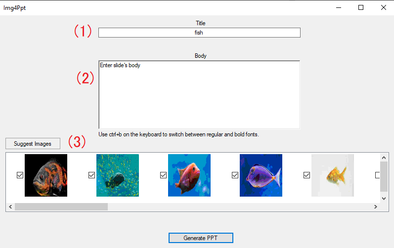
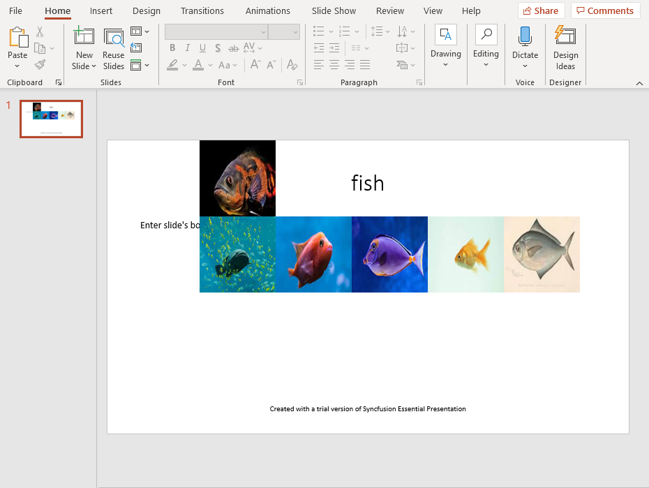

# Image for Powerpoint (Img4Ppt)

This windows application is made with Winform to provide images based on the title and **bolded phrases** in the description. Additionally, when you click "Generate PPT," it will generate a PowerPoint with the information you've entered and selected. This project uses the free version of Syncfusion so that the PowerPoint will contain a watermark.

## Requirement
Windows PC with (targeted) .NET framework 4.7+

## Usage

Run the executable from release (or rebuild the project) and enter what you want in your slide into the Title and Body input field (1 & 2). Once you're ready, hit the "Suggest Images" button (3) to generate some image suggestions and select the desired images.

To select an image to be added to the PowerPoint, either click on the image or the checkbox left of the images. To deselect, double click the images or uncheck the checked box.

## Contributing
Pull requests are welcome. For major changes, please open an issue first to discuss what you would like to change.

Please make sure to update the tests as appropriate.